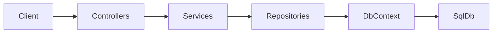

# Full API Layered Refactor Plan

## Goal
Replace Minimal API mappings in [d:/Transport_Logistics_System/src/Transport.Api/Program.cs](d:/Transport_Logistics_System/src/Transport.Api/Program.cs) with controllers that call services, services that call repositories, and repositories that use `TransportDbContext`.

## Target architecture

## Phase 1: Project structure and DI foundation
- Create folders in API project:
  - `Controllers/`
  - `Services/Interfaces/` and `Services/Implementations/`
  - `Repositories/Interfaces/` and `Repositories/Implementations/`
- Register all services/repositories in DI from [d:/Transport_Logistics_System/src/Transport.Api/Program.cs](d:/Transport_Logistics_System/src/Transport.Api/Program.cs).
- Add MVC controller setup (`AddControllers`, `MapControllers`) while keeping current auth, CORS, SignalR, Swagger, and migrations/seed behavior.
- Move shared claim/branch helper logic from endpoint-local code to reusable service/helper methods (e.g., branch id extraction from JWT).

## Phase 2: Controller migration by module (full set)
- Replace each Minimal API group with controller actions, preserving routes/verbs/response contracts from [d:/Transport_Logistics_System/src/Transport.Api/Contracts/ApiDtos.cs](d:/Transport_Logistics_System/src/Transport.Api/Contracts/ApiDtos.cs).
- Proposed controllers:
  - `AuthController` (`/api/auth/...`)
  - `BranchesController` (`/api/branches`, `/api/public/branches`)
  - `ReportsController` (`/api/reports/...`)
  - `DriversController` (`/api/drivers/...`)
  - `StaffController` (`/api/staff/...`)
  - `BranchManagersController` (`/api/branch-managers/...`)
  - `ProductsController` (`/api/products/...`)
  - `TripsController` (`/api/trips/...`)
  - `TrackingController` (`/api/tracking/...`)
- Keep Hub endpoints in Program (`MapHub`) since SignalR hubs are not controller-based.

## Phase 3: Service layer design
- Introduce business services per module encapsulating:
  - Role checks and branch-scope rules (Admin vs BranchManager vs Staff)
  - Validation and domain rules (delivery restrictions, branch-specific product visibility, date-range reports)
  - DTO mapping for controller responses
- Keep auth token issuance via existing [d:/Transport_Logistics_System/src/Transport.Api/Services/TokenService.cs](d:/Transport_Logistics_System/src/Transport.Api/Services/TokenService.cs), called from `AuthService`.

## Phase 4: Repository layer design
- Create repositories focused on data access only:
  - `IUserRepository`, `IBranchRepository`, `IProductRepository`, `IDriverRepository`, `ITripRepository`, `IReportRepository`
- Move EF queries from Program into repositories, including joins and projections currently used by products/reports/staff/drivers.
- Keep transaction logic (e.g., trip load/unload) in service layer while repository exposes transaction-compatible methods.

## Phase 5: Authorization strategy in controllers
- Use `[Authorize]` at controller/action level and service-level policy checks for fine-grained branch restrictions.
- Keep JWT claim usage (`branch_id`, `driver_profile_id`) consistent with current token shape.
- Preserve existing forbidden/bad-request semantics where behavior matters to current web/mobile clients.

## Phase 6: Cutover and cleanup
- After each module is migrated and validated, remove corresponding Minimal API mappings from [d:/Transport_Logistics_System/src/Transport.Api/Program.cs](d:/Transport_Logistics_System/src/Transport.Api/Program.cs).
- Keep startup-only concerns in Program: infra registration, auth/CORS/Swagger setup, `MapControllers`, `MapHub`, migrations/seed.

## Validation plan
- Build and run:
  - `dotnet build` (API)
  - web/mobile smoke tests against migrated endpoints
- Regression checks:
  - Login + token claims
  - Role-limited data scopes (especially BranchManager rules)
  - Product lifecycle (create/load/unload/deliver)
  - Reports date filters and branch scoping
  - Driver live tracking endpoint behavior

## Risk controls
- Migrate module-by-module behind same routes to avoid frontend changes.
- Preserve DTO contracts from [d:/Transport_Logistics_System/src/Transport.Api/Contracts/ApiDtos.cs](d:/Transport_Logistics_System/src/Transport.Api/Contracts/ApiDtos.cs).
- Keep business rules centralized in services to prevent duplicated role logic across controllers.