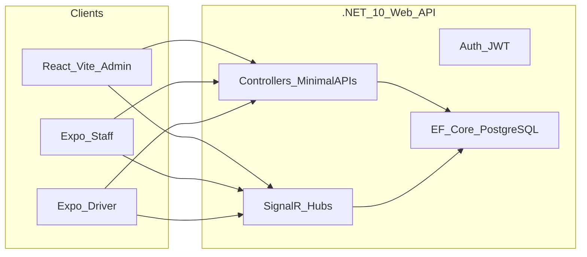

# End-to-End Transport Logistics System — Implementation Plan

## Context

- **Workspace**: [`d:\Transport_Logistics_System`](d:\Transport_Logistics_System) is empty; this is a **greenfield** scaffold.
- **Naming**: Phases refer to “LoadingTrip”; the ER diagram uses `TRIP`. Use a single **`Trip`** entity (and `TripProduct` / `TRIP_PRODUCTS` junction). Documentation can call it “loading trip” in UX copy.
- **Gap in diagram**: [`GET /api/staff/available-drivers`](GET /api/staff/available-drivers) requires **`IsOnline`**; add `bool IsOnline` (and optionally `LastSeenAt`) on [`DriverProfile`](DriverProfile) — not shown in the ER diagram but required by your workflow.

## High-level architecture

---

## Phase 1 — .NET 10 API and database

**Solution layout (modular monolith)**

- Single ASP.NET Core Web API host (e.g. `src/Transport.Api`) referencing feature-focused libraries to keep boundaries clear without separate deployables:
  - `Transport.Domain` — entities, enums (`UserRole`, `ProductStatus`, `TripStatus`).
  - `Transport.Infrastructure` — `DbContext`, EF configurations, migrations, repository/unit-of-work if needed.
  - Optional: `Transport.Application` — commands/queries if you want CQRS-style organization later; can start thin with services in `Transport.Api` and extract when complexity grows.

**EF Core + PostgreSQL**

- Packages: `Npgsql.EntityFrameworkCore.PostgreSQL`, design-time tools for migrations.
- Connection string via `appsettings` + user secrets / env vars for production.

**Entities (aligned to your ER diagram)**

| Entity | Notes |
|--------|--------|
| `Branch` | `Id`, `BranchName`, `Code`, `Address` |
| `User` | `Id`, `BranchId` (nullable), `FullName`, `Role`, `IsActive` |
| `DriverProfile` | `Id`, `UserId`, `VehicleNumber`, `IsApproved`, `CurrentLat`, `CurrentLng`, **`IsOnline`** |
| `Product` | `Guid` PK, `TrackingNumber` (unique, for QR), sender/receiver fields, `OriginBranchId`, `DestinationBranchId`, `CurrentBranchId` (nullable), `Status`, `CreatedAt`, `DeliveredAt` |
| `Trip` | `Guid` PK, `DriverId` (FK to user/driver profile per your linking choice — see below), `OriginBranchId`, `DestinationBranchId`, `LoadTime`, `Status` |
| `TripProduct` | composite/junction: `TripId`, `ProductId` |

**Relationship detail**: Spec shows `TRIP.driver_id` FK; map either `Trip.DriverId` → `User.Id` where `Role == Driver`, or → `DriverProfile.Id`. Prefer **`Trip.DriverProfileId` → `DriverProfile`** for clearer driver semantics and to align with “select driver” in staff flow.

**DbContext**: `DbSet` for each entity; fluent API for indexes (`TrackingNumber` unique), FK cascade rules, and enum storage as strings for readability.

**Deliverable**: Running API project, initial migration, seed optional dev data (branches + admin user).

---

## Phase 2 — Authentication and approval logic

**JWT**

- ASP.NET Core Identity optional vs custom users table: given explicit `User`/`Role` model, either:
  - **Lightweight**: JWT issued manually from `User` table + password hashing (e.g. ASP.NET Identity password hasher or BCrypt), claims: `sub`, `role`, **`branch_id`** (when applicable), `driver_profile_id` if driver.
  - **Identity**: Map Identity user to `User`/`DriverProfile` — more ceremony; use only if you need external providers soon.

**Endpoints (minimum)**

- Auth: register/login/refresh as needed; include **`BranchId` in claims** for staff scoped to branch.
- **Admin**: list pending drivers (`IsApproved == false`), **`PATCH /api/drivers/{id}/approve`** → `IsApproved = true` (authorize `Admin` only).
- **Staff**: **`GET /api/staff/available-drivers`** — filter: `IsApproved == true && IsOnline == true &&` driver’s branch matches **current staff’s `BranchId` from JWT** (define rule: driver associated to branch via `User.BranchId` or `DriverProfile` extension — document one rule and enforce consistently).

**SignalR (approval path)**

- On approve, notify driver client via hub method/group keyed by `userId` or `driverProfileId` so the mobile app can leave the “waiting” screen.

---

## Phase 3 — Loading handshake API

**Bulk load / trip creation**

- One transactional operation (recommended shape):

  - **Input**: `DriverProfileId` (or `UserId` if you standardized on user), `List<Guid> productIds`, and optionally `DestinationBranchId` if not inferred from products.
  - **Validate**: staff JWT `BranchId` matches **origin** context (products’ `CurrentBranchId` or staff branch — align with “staff at branch loading dock”).
  - **Create** `Trip` with `Status = Active`, `LoadTime = UtcNow`, `OriginBranchId` / `DestinationBranchId` from business rule (e.g. destination from shared `Product.DestinationBranchId` for batch consistency).
  - **Insert** `TripProduct` rows for each product.
  - **Update** each `Product`: `Status = InTransit`, **`CurrentBranchId = null`**.

- Idempotency: reject if any product is already `InTransit` or invalid state; return clear problem details.

**REST shape**: e.g. `POST /api/trips/load` or `POST /api/loading/confirm` with the bulk payload (your spec’s “bulk update endpoint”).

---

## Phase 4 — Mobile and web UI

**React admin (Vite + Tailwind + Lucide)**

- **Pending approvals** page: table + Approve action calling `PATCH`.
- **Driver management**: list approved drivers, optional toggles if you add them later.
- **Live map**: Google Maps JavaScript API — markers updated from **SignalR** hub events (driver locations). Store API key in env (`VITE_*`).
- **QR labels**: generate QR in browser with **`qrcode.react`** from **`Product.TrackingNumber`** (server only stores string; no server-side QR rendering).

**Expo — Driver**

- Registration: name, mobile, vehicle → POST register → show **locked “Waiting for approval”** until SignalR or polling detects approval (SignalR preferred).
- Background location: use Expo location + task APIs where supported; **push lat/lng to SignalR every ~30s** when trip active / approved (respect battery and permissions).

**Expo — Staff**

- **Driver selection**: `GET /api/staff/available-drivers`, pick driver, start loading session (client state + optional `POST` to create draft trip or defer trip creation until confirm — prefer **create trip on confirm** to match “Loading Session” wording).
- **QR batch scan**: `expo-barcode-scanner`; accumulate scanned IDs in a **`FlatList`**; on **Confirm Load**, call bulk endpoint with selected driver + product GUID list.

**Shared API contract**

- OpenAPI/Swagger from ASP.NET for typed clients or hand-maintained DTOs in a small `packages/api-types` if desired later.

---

## Cross-cutting checklist

- **CORS**: allow Vite dev origin + Expo dev URLs.
- **HTTPS** in production; secure JWT storage on mobile (Expo SecureStore for refresh tokens if used).
- **SignalR scale-out**: single instance first; Redis backplane only if you deploy multiple API nodes later.

---

## Suggested implementation order

1. Phase 1 — DB + entities + migrate + health endpoint.
2. Phase 2 — JWT + approval + staff drivers list + SignalR approval notification.
3. Phase 3 — bulk load transaction + trip linkage.
4. Phase 4 — Admin web (approvals + map + QR), then Driver Expo, then Staff Expo (scanner last to consume stable API).
