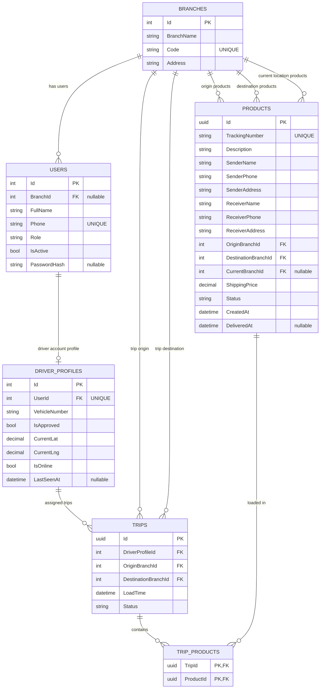
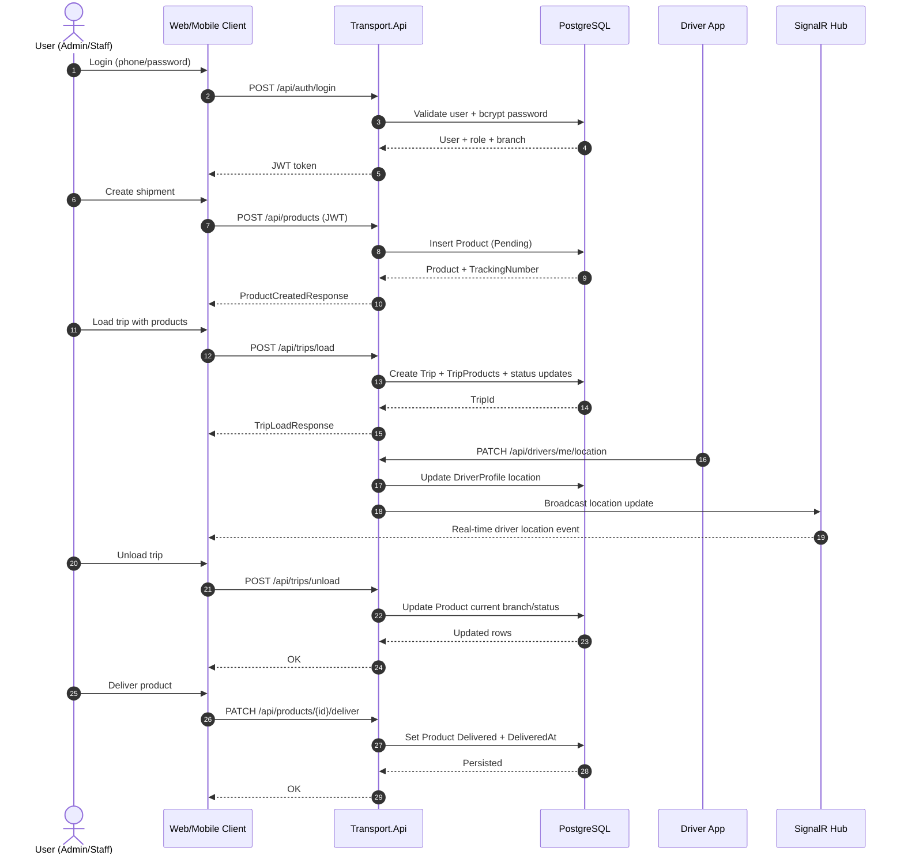
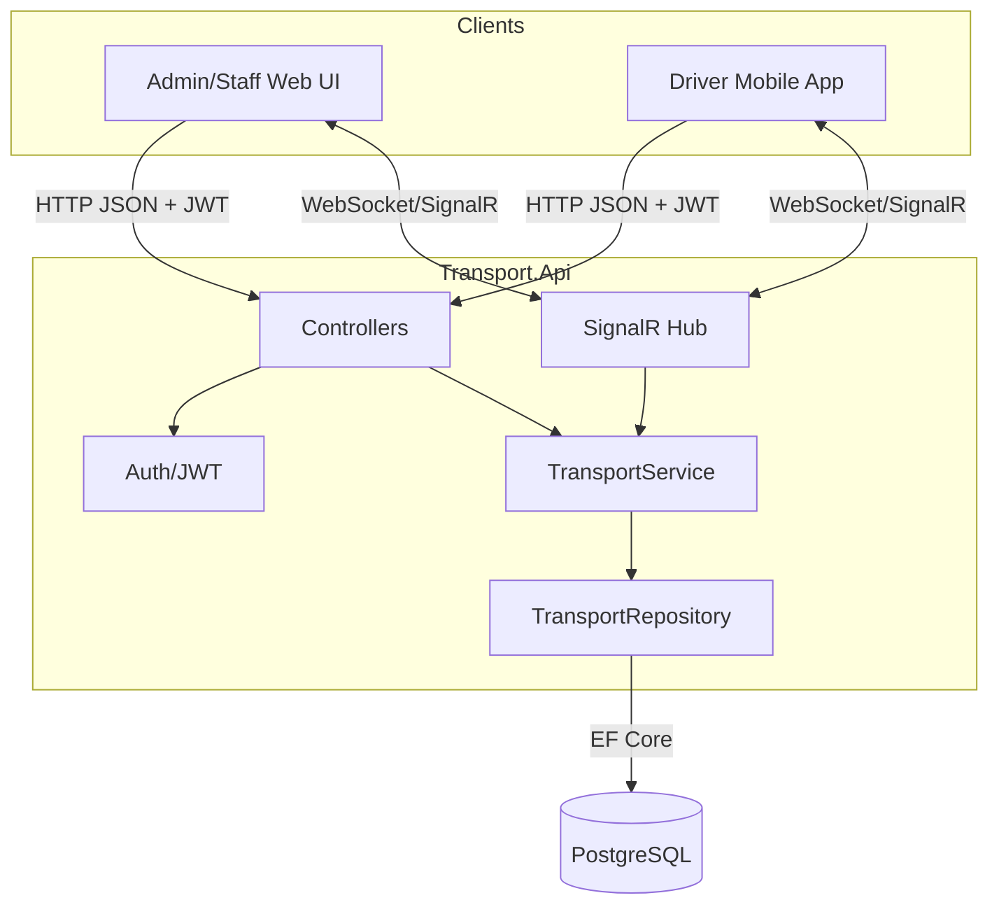

# Transport Logistics System

Modular logistics platform with:
- `Transport.Api`: ASP.NET Core API (.NET 10), JWT auth, SignalR, EF Core
- `Transport.Infrastructure`: EF Core + PostgreSQL integration
- `Transport.Domain`: Core entities and enums
- `apps/web`: React + Vite admin portal
- `apps/mobile`: Expo mobile client

---

## 1) System Architecture

### High-level architecture

```mermaid
flowchart LR
    A[Web Admin (React/Vite)] -->|REST + JWT| B[Transport.Api]
    M[Mobile App (Expo)] -->|REST + JWT| B
    A -->|SignalR /hubs/transport| B
    M -->|SignalR /hubs/transport| B
    B -->|EF Core| D[(PostgreSQL)]
```

### Backend design (layered)

- `Controllers`: HTTP endpoints, authorization attributes, request mapping.
- `Services`: business logic and role-based rules (`ITransportService` / `TransportService`).
- `Repositories`: data access abstraction (`ITransportRepository`).
- `Domain Entities`: `User`, `DriverProfile`, `Branch`, `Product`, `Trip`, `TripProduct`.
- Cross-cutting:
  - JWT authentication/authorization
  - SignalR hub (`/hubs/transport`) for real-time driver/event updates
  - EF Core migrations + startup auto-migrate + seed

### Runtime components (Docker)

- `postgres`: PostgreSQL 16, database `transport`, port `5432`
- `api`: ASP.NET Core API exposed on host `5000` (container `8080`)
- `web`: Nginx-served static React app on host `3000`
- `mobile`: Expo/Metro dev server on `8081`, `19000-19002`

Start all services:

```bash
docker compose up --build
```

Useful URLs:
- API health: `http://localhost:5000/health`
- Swagger: `http://localhost:5000/swagger`
- Admin web: `http://localhost:3000`

---

## 2) Database Design (Full ER Diagram)

The schema is managed by EF Core (`TransportDbContext`) and migrations in `src/Transport.Infrastructure/Data/Migrations`.



### Relationship and constraint notes

- `Users.Phone` is unique.
- `Branches.Code` is unique.
- `Products.TrackingNumber` is unique.
- `DriverProfiles.UserId` is one-to-one with `Users.Id`.
- `TripProducts` is a many-to-many junction with composite primary key (`TripId`, `ProductId`).
- Delete behavior:
  - `User -> Branch`: `SetNull` on branch deletion
  - `DriverProfile -> User`: `Cascade`
  - `Product -> OriginBranch / DestinationBranch`: `Restrict`
  - `Product -> CurrentBranch`: `SetNull`
  - `Trip -> DriverProfile / Branches`: `Restrict`
  - `TripProduct -> Trip`: `Cascade`
  - `TripProduct -> Product`: `Restrict`

---

## 3) Sequence Diagram (Shipment Lifecycle)

This sequence shows the common flow from login to delivery:



---

## 4) Data Flow Diagram



### Data movement by feature

- Auth flow: Client -> `AuthController` -> `TransportService.LoginAsync` -> DB -> JWT token.
- Product/trip flow: Client -> controller -> service business rules -> repository -> EF Core -> PostgreSQL.
- Real-time tracking: Driver updates location/presence -> API updates `DriverProfiles` -> SignalR pushes events to subscribed clients.
- Reporting: `ReportsController` aggregates delivered `Products` by destination branch and date range.

---

## 5) Configuration and Credentials (Crucial)

### Environment variables (core)

- API:
  - `ConnectionStrings__DefaultConnection`
  - `Jwt__Key`
  - `Jwt__Issuer`
  - `Jwt__Audience`
  - `Cors__Origins__0..n`
- Web build args:
  - `VITE_API_URL`
  - `VITE_SIGNALR_URL`
  - `VITE_GOOGLE_MAPS_API_KEY`
- Mobile:
  - `EXPO_PUBLIC_API_URL`
  - `REACT_NATIVE_PACKAGER_HOSTNAME`

### Current development defaults (from Docker Compose)

- PostgreSQL:
  - Host: `localhost`
  - Port: `5432`
  - DB: `transport`
  - User: `postgres`
  - Password: `postgres`
- API JWT:
  - `Jwt__Key=development-key-must-be-at-least-32-characters-long!`
  - Issuer/Audience: `Transport`
- Seeded users:
  - `admin` / `Admin123!`
  - `staff` / `Staff123!`

### Security notes (important)

- These credentials are development-only; do not use in production.
- Rotate `Jwt__Key`, DB password, and seeded credentials before deployment.
- Restrict CORS origins to known client domains.
- Keep secrets in environment variables or secret stores, not in source control.

---

## 6) API Surface (Functional Design)

Main endpoint groups:
- Auth: `/api/auth/login`, `/api/auth/register-driver`
- Branches: `/api/public/branches`, `/api/branches`
- Products: `/api/products`, `/api/products/{id}/deliver`
- Trips: `/api/trips/load`, `/api/trips/unload`
- Drivers: pending/approved, approve, branch change, self presence/location/status
- Tracking: `/api/tracking/driver-locations`
- Staff and branch managers CRUD
- Reports: `/api/reports/branch-collections`
- Health: `/health`

Authorization is role-driven through JWT claims (`Admin`, `BranchManager`, `Staff`, `Driver`), with restrictions enforced in service methods.

---

## 7) How to Test

### A. End-to-end smoke test with Docker

1. Start stack:
   ```bash
   docker compose up --build
   ```
2. Verify API health:
   ```bash
   curl http://localhost:5000/health
   ```
3. Open Swagger:
   - `http://localhost:5000/swagger`
4. Login from web:
   - `http://localhost:3000`
   - use seeded credentials above.

### B. Backend-only local test

1. Restore tools/packages:
   ```bash
   dotnet tool restore
   dotnet restore
   ```
2. Apply migrations:
   ```bash
   dotnet ef database update --project src/Transport.Infrastructure --startup-project src/Transport.Api
   ```
3. Run API:
   ```bash
   dotnet run --project src/Transport.Api
   ```
4. Test key scenarios in Swagger/Postman:
   - Login
   - Create product
   - Load/unload trip
   - Deliver product
   - Driver location update and live tracking
   - Branch collection report with date filters

### C. Frontend test

- Web:
  ```bash
  cd apps/web
  npm install
  npm run dev
  ```
- Mobile:
  ```bash
  cd apps/mobile
  npm install
  npm start
  ```

### D. Regression checklist (recommended)

- Role-based access works for all protected endpoints.
- Product status transitions are valid (`Pending` -> in transit/unloaded -> `Delivered`).
- Delivered items populate reports with correct `ShippingPrice` totals.
- Driver approval + presence + location updates are reflected in real-time on clients.
- Branch/product/trip delete constraints prevent invalid data loss.

---

## 8) Deployment/Operations Notes

- API applies migrations automatically at startup (`Database.MigrateAsync()`), then seeds initial data.
- For production, use a managed database, secure secrets provider, and TLS termination.
- Configure environment-specific CORS and API base URLs for web/mobile builds.
