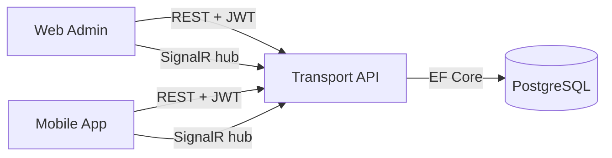
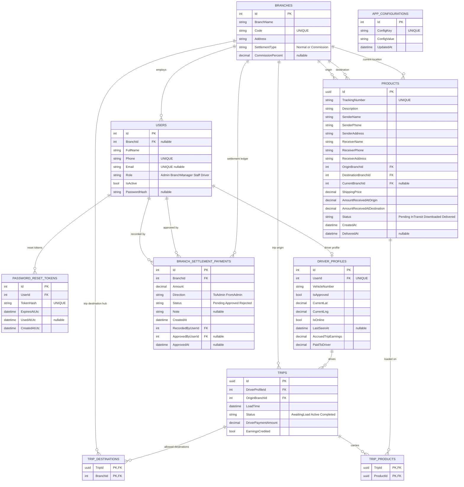
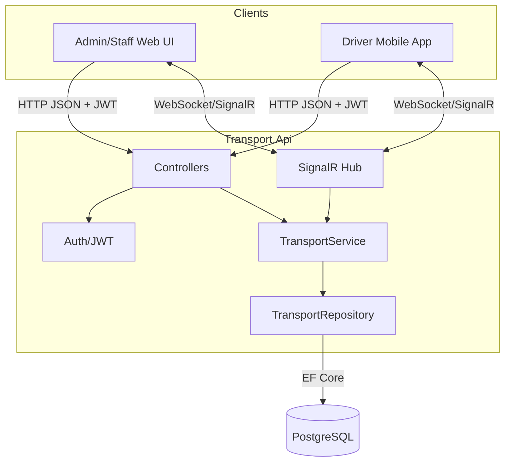

# Transport Logistics System

Modular logistics platform with:
- `Transport.Api`: ASP.NET Core API (.NET 10), JWT auth, SignalR, EF Core
- `Transport.Infrastructure`: EF Core + PostgreSQL integration
- `Transport.Domain`: Core entities and enums
- `apps/web`: React + Vite admin portal
- `apps/mobile`: Expo mobile client

---

## 1) System Architecture

### High-level architecture



### Backend design (layered)

- `Controllers`: HTTP endpoints, authorization attributes, request mapping.
- `Services`: business logic and role-based rules (`ITransportService` / `TransportService`).
- `Repositories`: data access abstraction (`ITransportRepository`).
- `Domain Entities`: `User`, `DriverProfile`, `Branch`, `Product`, `Trip`, `TripDestination`, `TripProduct`, `BranchSettlementPayment`, `PasswordResetToken`, `AppConfiguration`.
- Cross-cutting:
  - JWT authentication/authorization
  - SignalR hub (`/hubs/transport`) for real-time driver/event updates
  - EF Core migrations + startup auto-migrate + seed

### Runtime components (Docker)

- `postgres`: PostgreSQL 16, database `transport`, port `5432`
- `api`: ASP.NET Core API exposed on host `5000` (container `8080`)
- `web`: Nginx-served static React app on host `3000`
- `mobile`: Expo/Metro dev server on `8081`, `19000-19002`

Start all services:

```bash
docker compose up --build
```

Useful URLs:
- API health: `http://localhost:5000/health`
- Swagger: `http://localhost:5000/swagger`
- Admin web: `http://localhost:3000`

---

## 2) Database Design (Full ER Diagram)

The schema is managed by EF Core (`TransportDbContext`) and migrations in `src/Transport.Infrastructure/Data/Migrations`.



### Entity summaries

| Entity | Purpose |
|--------|---------|
| `Branches` | Hub locations with **Normal** or **Commission** settlement rules |
| `Users` | Login accounts (`Admin`, `BranchManager`, `Staff`, `Driver`) optionally tied to a branch |
| `DriverProfiles` | Driver vehicle, approval, GPS, online presence, trip earnings balance |
| `Products` | Shipments (sender/receiver parties, payment splits, status lifecycle) |
| `Trips` | Driver run from an origin branch; may serve **multiple destination branches** |
| `TripDestinations` | Allowed destination hubs for a planned trip (composite PK) |
| `TripProducts` | Parcels loaded on a trip (composite PK) |
| `BranchSettlementPayments` | Partial branch↔admin settlements with optional **admin approval** |
| `PasswordResetTokens` | Hashed tokens for admin email password recovery |
| `AppConfigurations` | Key/value settings (e.g. Google Maps API key) |

### Product status lifecycle

```text
Pending  →  InTransit  →  Downloaded  →  Delivered
(at origin)   (on truck)   (at dest hub)   (handed to receiver)
```

### Trip status lifecycle

```text
AwaitingLoad  →  Active  →  Completed
(planned)         (driver started)   (all parcels unloaded; earnings credited)
```

### Relationship and constraint notes

- `Users.Phone` is unique; `Users.Email` is unique when not null.
- `Branches.Code` is unique.
- `Products.TrackingNumber` is unique.
- `DriverProfiles.UserId` is one-to-one with `Users.Id`.
- `TripDestinations` and `TripProducts` use composite primary keys (`TripId` + `BranchId` / `ProductId`).
- A trip has **one origin** (`Trips.OriginBranchId`) and **many destinations** via `TripDestinations` (replaces a single destination column on trips).
- `BranchSettlementPayments`: only **Approved** rows reduce settlement balances; branch-manager **ToAdmin** payments start as **Pending** until admin approves; admin-recorded payments are approved immediately.
- Delete behavior (high level):
  - `User → Branch`: `SetNull`
  - `DriverProfile → User`: `Cascade`
  - `PasswordResetToken → User`: `Cascade`
  - `Product → OriginBranch / DestinationBranch`: `Restrict`
  - `Product → CurrentBranch`: `SetNull`
  - `Trip → DriverProfile / OriginBranch`: `Restrict`
  - `TripDestination → Trip`: `Cascade`; `TripDestination → Branch`: `Restrict`
  - `TripProduct → Trip`: `Cascade`; `TripProduct → Product`: `Restrict`
  - `BranchSettlementPayment → Branch`: `Cascade`; `→ User` (recorded/approved): `Restrict`

---

## 3) Sequence Diagram (Shipment Lifecycle)

End-to-end flow covering driver onboarding, multi-destination trips, parcel status transitions, delivery verification, trip completion with driver earnings, and branch settlement payments.

### Product and trip status reference

| Stage | Product status | Trip status (if applicable) |
|-------|----------------|----------------------------|
| Booked at origin | `Pending` | `AwaitingLoad` (planned trip) or created ad-hoc on first load |
| Scanned onto truck | `InTransit` | `AwaitingLoad` until driver starts, then `Active` |
| Arrived at destination hub | `Downloaded` | `Active` until all parcels on trip are unloaded |
| Handed to receiver | `Delivered` | `Completed` when no `InTransit` parcels remain on trip |

```mermaid
sequenceDiagram
    autonumber
    actor Admin as Admin / Branch Manager
    actor Staff as Staff (origin / dest)
    actor Drv as Driver (mobile)
    participant Web as Web Console
    participant Mob as Mobile App
    participant API as Transport.Api
    participant DB as PostgreSQL
    participant Hub as SignalR Hub

  rect rgb(30,30,40)
    Note over Admin,DB: Authentication
    Admin->>Web: Login
    Web->>API: POST /api/auth/login
    API->>DB: Validate credentials
    API-->>Web: JWT (role, branchId)
  end

  rect rgb(30,40,30)
    Note over Drv,DB: Driver onboarding (optional)
    Drv->>Mob: Register
    Mob->>API: POST /api/auth/register-driver
    API->>DB: User + DriverProfile (IsApproved=false)
    Admin->>Web: Approve driver
    Web->>API: PATCH /api/drivers/{id}/approve
    API->>DB: IsApproved=true
  end

  rect rgb(40,35,30)
    Note over Admin,DB: Plan trip (multi-destination)
    Admin->>Web: Create trip (driver, origin, destination branch IDs, driver pay)
    Web->>API: POST /api/trips
    API->>DB: Trip (AwaitingLoad) + TripDestinations
    API-->>Web: tripId
  end

  rect rgb(35,35,45)
    Note over Admin,DB: Book shipment at origin
    Admin->>Web: Create product (parties, branches, shipping, origin payment)
    Web->>API: POST /api/products
    API->>DB: Product Pending, CurrentBranch=origin
    API-->>Web: trackingNumber
  end

  rect rgb(45,40,30)
    Note over Staff,DB: Load at origin (planned or ad-hoc trip)
    Staff->>Web: Scan/select parcels + driver (+ optional tripId)
    Web->>API: POST /api/trips/load
    alt Planned trip (tripId provided)
      API->>DB: TripProducts, Product→InTransit, CurrentBranch=null
      Note right of API: Validates trip AwaitingLoad, dest on trip route
    else Ad-hoc load (no tripId)
      API->>DB: New Trip Active + TripDestinations from parcel dests
      API->>DB: TripProducts, Product→InTransit
    end
    API-->>Web: TripLoadResponse
  end

  rect rgb(30,45,40)
    Note over Drv,DB: Driver starts planned trip
    Drv->>Mob: Start trip
    Mob->>API: POST /api/drivers/me/trips/{tripId}/start
    API->>DB: Trip AwaitingLoad → Active
  end

  par Live tracking
    Drv->>Mob: GPS update
    Mob->>API: PATCH /api/drivers/me/location
    API->>DB: DriverProfile lat/lng
    API->>Hub: Broadcast DriverLocationUpdated
    Hub-->>Web: Live map marker update
  end

  rect rgb(40,30,35)
    Note over Staff,DB: Unload at destination hub
    Staff->>Web: Unload parcels at destination branch
    Web->>API: POST /api/trips/unload
    API->>DB: Product→Downloaded, CurrentBranch=dest
    API->>DB: TryCompleteTrip (no InTransit left → Trip Completed, credit driver earnings)
    API-->>Web: unloadedCount
  end

  rect rgb(35,45,35)
    Note over Staff,DB: Deliver to receiver
    Staff->>Web: Deliver (receiver phone verify, collect balance if due)
    Web->>API: PATCH /api/products/{id}/deliver
    API->>DB: Validate phone + AmountReceivedAtDestination
    API->>DB: Product→Delivered, DeliveredAt set
    API-->>Web: 204 No Content
  end

  rect rgb(45,35,45)
    Note over Admin,DB: Branch settlement (post-delivery reporting)
    Admin->>Web: View settlement (delivered collections − approved payments)
    alt Branch manager pays admin
      Admin->>Web: Submit payment ToAdmin
      Web->>API: POST /api/branches/{id}/settlement/payments
      API->>DB: Payment Pending (not in balance yet)
      Admin->>Web: Approve on Approvals or branch settlement
      Web->>API: PATCH .../payments/{id}/approve
      API->>DB: Status→Approved, balance updated
    else Admin records payment
      Admin->>Web: Record ToAdmin or FromAdmin
      Web->>API: POST /api/branches/{id}/settlement/payments
      API->>DB: Payment Approved immediately
    end
  end
```



### Lifecycle notes

- **Create product**: `Admin` or `BranchManager` (origin must be manager’s branch). Collects `AmountReceivedAtOrigin` up to `ShippingPrice`.
- **Load**: `Staff` or `BranchManager` at origin. Parcels must be `Pending` and at the branch. Planned loads require destination ∈ `TripDestinations`.
- **Driver start**: Only after at least one parcel is loaded; moves trip `AwaitingLoad` → `Active`.
- **Unload**: Only at **destination** branch; sets `Downloaded`. When every parcel on the trip is off the truck, trip → `Completed` and `DriverPaymentAmount` accrues to the driver profile (once).
- **Deliver**: Only `Downloaded` parcels; receiver phone must match; any remaining shipping balance collected at destination.
- **Customers view**: Derived from product sender/receiver phones (`GET /api/customers`); admins see all, branch managers see customers linked to their branch’s shipments.

---

## 4) Data Flow Diagram



### Data movement by feature

- **Auth**: Client → `AuthController` → login / register-driver / password reset → JWT with role + `branchId`.
- **Shipments**: Product CRUD, trip create/load/unload, deliver — service enforces role, branch scope, and status transitions.
- **Drivers**: Approval, presence, GPS, trip start, earnings accrual and payout.
- **Settlement**: Delivered-product collections vs approved `BranchSettlementPayments`; branch-manager payments may stay `Pending` until admin approval.
- **Customers**: Aggregated sender/receiver stats from `Products` (scoped by branch for managers).
- **Real-time**: Driver location/presence → `DriverProfiles` → SignalR hub → live map on web console.
- **Reporting**: Branch collections and bookings-by-destination from delivered / pending products.

---

## 5) Configuration and Credentials (Crucial)

### Environment variables (core)

- API:
  - `ConnectionStrings__DefaultConnection`
  - `Jwt__Key`
  - `Jwt__Issuer`
  - `Jwt__Audience`
  - `Cors__Origins__0..n`
- Web build args:
  - `VITE_API_URL`
  - `VITE_SIGNALR_URL`
  - `VITE_GOOGLE_MAPS_API_KEY`
- Mobile:
  - `EXPO_PUBLIC_API_URL`
  - `REACT_NATIVE_PACKAGER_HOSTNAME`

### Current development defaults (from Docker Compose)

- PostgreSQL:
  - Host: `localhost`
  - Port: `5432`
  - DB: `transport`
  - User: `postgres`
  - Password: `postgres`
- API JWT:
  - `Jwt__Key=development-key-must-be-at-least-32-characters-long!`
  - Issuer/Audience: `Transport`
- Seeded users:
  - `admin` / `Admin123!`
  - `staff` / `Staff123!`

### Security notes (important)

- These credentials are development-only; do not use in production.
- Rotate `Jwt__Key`, DB password, and seeded credentials before deployment.
- Restrict CORS origins to known client domains.
- Keep secrets in environment variables or secret stores, not in source control.

---

## 6) API Surface (Functional Design)

Main endpoint groups:
- **Auth**: `/api/auth/login`, `/api/auth/register-driver`, `/api/auth/me/account`, `/api/auth/forgot-password`, `/api/auth/reset-password`
- **Branches**: `/api/public/branches`, `/api/branches`, settlement (`/settlement`, `/settlement/payments`, pending approve/reject)
- **Products**: `/api/products`, `/api/products/{id}`, `/api/products/{id}/deliver`
- **Trips**: `/api/trips` (create/list/update), `/api/trips/load`, `/api/trips/unload`
- **Drivers**: pending/approved, approve, profile, presence/location, trip state/start, earnings/payout
- **Customers**: `/api/customers` (aggregated sender/receiver counts; branch-scoped for managers)
- **Staff / branch managers**: CRUD, password reset, product lookup
- **Tracking**: `/api/tracking/driver-locations`, `/api/tracking/map-settings`
- **Reports**: `/api/reports/branch-collections`, `/api/reports/bookings-by-destination`
- **Configuration**: `/api/configurations/{key}` (admin)
- **Health**: `/health`

Authorization is role-driven through JWT claims (`Admin`, `BranchManager`, `Staff`, `Driver`), with branch scoping and business rules enforced in `TransportService`.

---

## 7) How to Test

### A. End-to-end smoke test with Docker

1. Start stack:
   ```bash
   docker compose up --build
   ```
2. Verify API health:
   ```bash
   curl http://localhost:5000/health
   ```
3. Open Swagger:
   - `http://localhost:5000/swagger`
4. Login from web:
   - `http://localhost:3000`
   - use seeded credentials above.

### B. Backend-only local test

1. Restore tools/packages:
   ```bash
   dotnet tool restore
   dotnet restore
   ```
2. Apply migrations:
   ```bash
   dotnet ef database update --project src/Transport.Infrastructure --startup-project src/Transport.Api
   ```
3. Run API:
   ```bash
   dotnet run --project src/Transport.Api
   ```
4. Test key scenarios in Swagger/Postman:
   - Login
   - Create product
   - Load/unload trip
   - Deliver product
   - Driver location update and live tracking
   - Branch collection report with date filters

### C. Frontend test

- Web:
  ```bash
  cd apps/web
  npm install
  npm run dev
  ```
- Mobile:
  ```bash
  cd apps/mobile
  npm install
  npm start
  ```

### D. Regression checklist (recommended)

- Role-based access works for all protected endpoints (including branch-scoped manager/staff rules).
- Product status transitions: `Pending` → `InTransit` → `Downloaded` → `Delivered` (invalid skips rejected).
- Trip lifecycle: `AwaitingLoad` → `Active` (driver start) → `Completed` (all parcels unloaded); driver earnings credited once.
- Multi-destination trips: load only accepts parcels whose destination is on the trip route.
- Delivery: receiver phone verification and destination payment rules enforced.
- Settlement: branch-manager `ToAdmin` payments stay pending until admin approval; admin payments settle immediately.
- Customers list: admin sees all; branch manager sees only branch-linked phones.
- Reports use delivered products and correct collection amounts (`AmountReceivedAtOrigin` / `AmountReceivedAtDestination`).
- Driver approval, presence, and location updates appear on the live map via SignalR.
- Delete constraints prevent removing branches/users/products/trips that are still referenced.

---

## 8) Deployment/Operations Notes

- API applies migrations automatically at startup (`Database.MigrateAsync()`), then seeds initial data.
- For production, use a managed database, secure secrets provider, and TLS termination.
- Configure environment-specific CORS and API base URLs for web/mobile builds.
